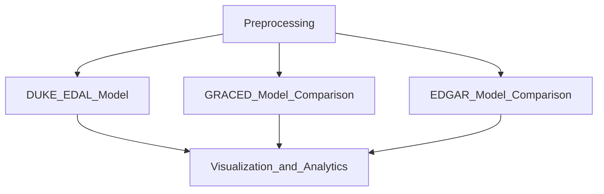

# Building Emissions Estimation

## General Code Workflow

## Run Instructions
Generally, running `run.py` is the mechanism through which the building emissions estimation process will be done, with modeling behavior and behavior defined in an associated `config.yaml` file. 

A few high-level options that exist for running the code, as defined in the `config.yaml` file. Each of these applies to a region also refined in `config.yaml`. Generally, a True/False flag in the `run` section of `config.yaml` will define which of the following steps to run via `run.py`. 
### Preprocessing
There are preprocessing steps that cover three general categories of data:
* Boundary. These data are associated with defining boundaries for each sub-region, particularly to associate with sub-regional features and targets. 
* Features. These data are each associated with distinct features associated with each region or sub-region. 
* Targets. These data are each associated with ground-truth targets against which to compare estimates. 

Within preprocessing, there are several key fields associated with each preprocessing element:
* The `path` defines where the processed data files go. It should be structured as `<directory>/<feature_prefix>` in the configuration file.
* The `include` flag is a boolean True/False flag that defines whether the preprocessing should include that preprocessing element. Boundary data are included by default, but all other data options can be optionally included or excluded. 
* The `generate_new` flag is a boolean True/False flag that defines whether the preprocessing should re-process the raw data associated with a feature from scratch. As this is a costly and time-consuming process, if the data have already been processed typically it is not necessary to generate them again -- unless there are changes that would require re-generating the processed data to serve as input to a modeled experiment. 

### Experiments
* Experiments. There are several times of modeling experiments that can be conducted using these building data.
    * Bottom-Up Model. This is the Duke Bottom-Up Model being released as part of v1 of this code. 
    * Regional Model. This is an eventual expansion of the Duke Regional Model that will be released as part of v2 of this code. 
    * GRACED Model Comparison. This provides output from the GRACED model to compare to our Duke model estimates. 
    * EDGAR Model Comparison. This provides output from the EDGAR model to compare to our Duke model estimates. 
* Validation. There are two types of validation that we will use to assess the quality of our estimates.
    * Visualization. One category of validation will be visualization-focused, with a variety of plots that provide insight into estimate quality. 
    * Analytics. The second category of validation primarily focuses on quantitative analytics to assess the quality of estimates. 

------
## Artifacts

This template is broadly based on the [Cookiecutter Data Science project](https://drivendata.github.io/cookiecutter-data-science/).

## Environment Management

You'll need to create an environment with the entries in requirements.txt. This can be done with a Python virtual environment or a Conda environment. I use [Mamba](https://mamba.readthedocs.io/en/latest/) for installing packages since it's far faster than Conda and can be used as a direct drop-in for Conda. Mamba can be downloaded [here](https://github.com/conda-forge/miniforge#mambaforge).

Creating a separate environment for each project that will require unique dependencies will likely save you time and frustration. 

Note: if you accidentally generate an environment that you didn't want, you can remove it using the command `conda remove --name ENV_NAME --all` where `ENV_NAME` is replaced with your environment name.

## Requirements.txt and its use

For generating requirements.txt files, create a list of the key dependencies in this file; if any of your code is version-specific, set the version as well [1], but limit the constraints to ensure dependencies can be successfully installed on other systems (this is especially true across platforms). Then to create the environment from the requirements.txt file, you can use the command `conda create --name ENV_NAME --file requirements.txt`.

[1] Specifying the version after an equal sign, such as `numpy=1.25.0`. Note this creates a `requirements.txt` file that is compatible with conda/mamba but differs from the version used when installing with `pip` (that requires a double equal sign `==`).

